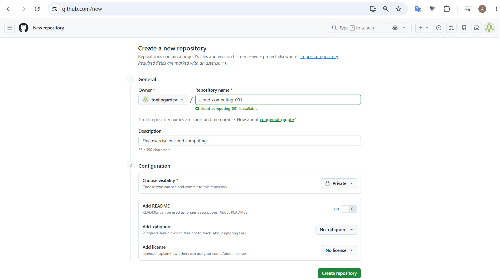
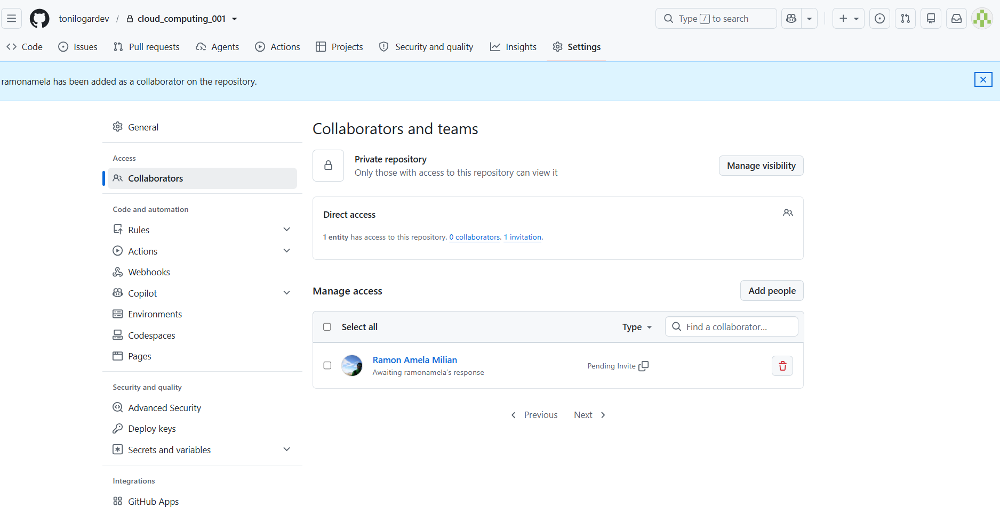

# Checklist Entrega 1 - Cloud Computing

A continuación se detalla todo lo que pide el enunciado de la entrega y el estado actual de cada tarea:

## 1. Git (25% de la nota)
- [ ] Crear cuenta en GitHub para los participantes del proyecto (si no se tiene).
- [ ] Crear un repositorio privado en GitHub.

- [ ] Invitar al usuario `@ramonamela` como colaborador al repositorio creado.

- [ ] Mover la plantilla (`activity_1_template`) al nuevo repositorio e inicializarlo con Git.
- [x] Hacer el primer commit con el mensaje "First commit". *(El código ya lo tiene preparado, solo faltará hacerlo al subirlo al repo definitivo)*.

## 2. Docker (20% de la nota)
- [x] Añadir los requisitos (requirements) necesarios al proyecto (`fastapi`, `pydantic`, `black`, `ruff`, etc).
- [x] Añadir tantos *targets* en el Dockerfile como consideres que debe tener un proyecto cloud escalable (hemos creado la base y el entorno `-dev`).

## 3. Docker Compose (25% de la nota)
- [x] Modificar el `docker-compose.yml` para usar los *targets* creados previamente.
- [x] Modificar el `docker-compose.yml` para usar un archivo de variables de entorno (`env_file`).
- [x] Modificar el `docker-compose.yml` para mapear el puerto del proyecto del 80 al puerto deseado (usando `8000:80`).
- [x] Incluir un target en el docker-compose para formatear el código con el comando exacto: `entrypoint: sh -c "black --config .black . && ruff check --fix"`. *(Asegurado que instala las versiones correctas: black 24.1.0 y ruff 0.1.14)*.

## 4. Project Setup FastAPI (30% de la nota)
- [x] Crear dos aplicaciones (módulos) separadas llamadas "authentication" y "files".
- [x] Crear *routers* dentro de ambas aplicaciones.
- [x] Importar los nuevos *routers* desde el archivo principal (`main.py`).
- [x] Crear los siguientes *endpoints* en los routers (solo que devuelvan 200 OK en Swagger, sin lógica de negocio):
  - **Authentication:** `POST /register`, `POST /login`, `POST /logout`, `GET /introspect`
  - **Files:** `GET /files`, `POST /files`, `GET /files/{id}`, `POST /files/{id}`, `DELETE /files/{id}`, `POST /files/merge`

## 5. Aspectos formales (Entrega final)
- [ ] Todo el código del proyecto debe entregarse en formato comprimido (.zip) a través del campus virtual.
- [ ] Incluir en la caja de texto de la entrega el **hash del commit** de GitHub que corresponde exactamente con la versión del código que va dentro del zip.
