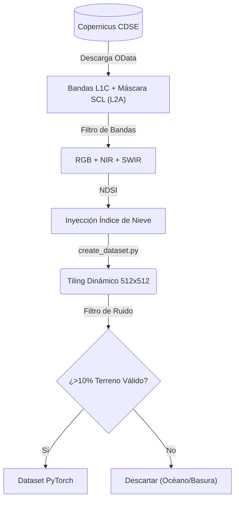
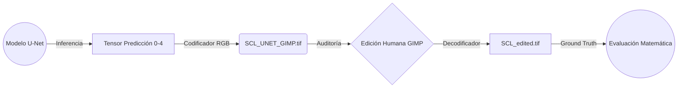
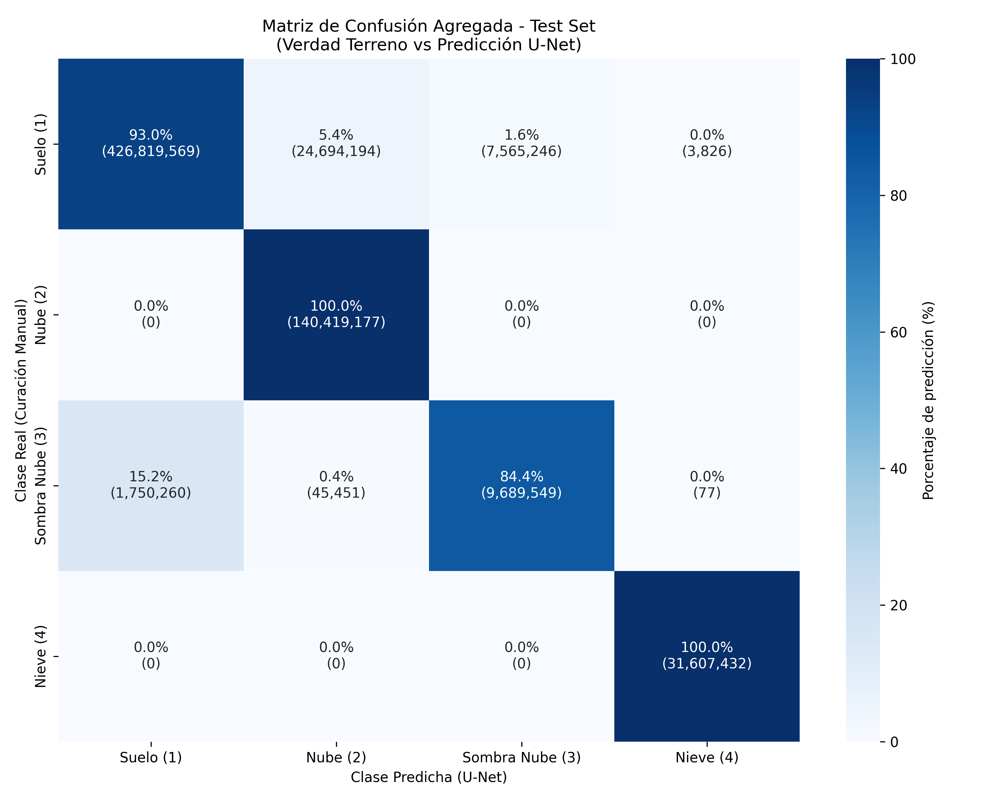

    

# Entrega 2: Desarrollo del Marco Teórico y Metodología

- **Página web del proyecto:** [https://tonilogar.github.io/tfb/tfb.html](https://tonilogar.github.io/tfb/tfb.html)
- **Documentación técnica extensa y repositorio:** [GitHub - Master Roadmap](https://github.com/tonilogardev/web_basic_project/blob/main_dev_pro_tfb/011_tfb/000_doc_tfb/000_master_roadmap_ml.md)

---

## 1. Marco Teórico y Estado del Arte

### 1.1 Contexto Tecnológico: La Misión Sentinel-2
El programa Copernicus, de la Agencia Espacial Europea (ESA), ha supuesto un punto de inflexión en la observación de la Tierra. La misión Sentinel-2 proporciona imágenes ópticas multiespectrales de alta resolución (hasta 10 metros por píxel) con una cadencia de revisita de 4 días (European Space Agency [ESA], 2026). Para procesar estas imágenes crudas (L1C) y convertirlas a reflectancia de la superficie terrestre (L2A), la ESA utiliza el procesador automatizado Sen2Cor, el cual incluye un módulo de Clasificación de Escenas (SCL) que genera una máscara de píxeles categorizando elementos como nubes, agua, vegetación o nieve.

### 1.2 El Problema: Limitaciones de Sen2Cor
De acuerdo con las validaciones empíricas de Baetens, Desjardins y Hagolle (2019), así como los hallazgos de Hollstein et al. (2016), el procesador heurístico Sen2Cor presenta deficiencias severas en geografías complejas como la cordillera de los Pirineos:
1. **Confusión Espectral:** La alta reflectancia de la nieve en las cumbres montañosas se confunde rutinariamente con la firma espectral de las nubes gruesas.
2. **Falsos Positivos Geométricos:** El algoritmo carece de percepción tridimensional, confundiendo sombras topográficas con sombras de nubes.
3. **Omisión Topográfica:** La incapacidad de diferenciar sombras proyectadas sobre laderas abruptas ha sido documentada por el Institut Cartogràfic i Geològic de Catalunya [ICGC] (2026).

### 1.3 Fundamentos de Inteligencia Artificial: La arquitectura U-Net
Para superar las heurísticas estáticas, se recurre al Aprendizaje Profundo (*Deep Learning*). Se ha seleccionado la arquitectura de Red Neuronal Convolucional **U-Net** (Ronneberger, Fischer, & Brox, 2015), debido a su excelencia en tareas de segmentación semántica biomédica, la cual ha sido exitosamente extrapolada a la teledetección (Wieland et al., 2019). Las conexiones residuales (*Skip Connections*) de la U-Net permiten fusionar el contexto semántico global de la imagen con la precisión espacial de bajo nivel, mitigando los falsos positivos en las transiciones de sombra y nieve.

---

## 2. Metodología de Desarrollo

### 2.1 Reducción de Dimensionalidad e Ingeniería de Características

Las máscaras SCL originales de Sen2Cor contienen 12 clases. Entrenar un modelo predictivo sobre 12 clases dispersaría el espacio latente matemático. Por ello, se ha diseñado un proceso de reducción de dimensionalidad, colapsando físicamente las clases originales en 5 Clases Maestras:
1. **Clase 0 (Basura / NoData)**
2. **Clase 1 (Suelo Útil)**
3. **Clase 2 (Nube)**
4. **Clase 3 (Sombra Nube)**
5. **Clase 4 (Nieve)**

Adicionalmente, el tensor de entrada incorpora calculos dinámicos del índice **NDSI** (*Normalized Difference Snow Index*), proporcionando a la red un gradiente diferencial matemático explícito entre la nieve y las nubes.

### 2.2 La Paradoja de Edición y Clasificación Manual (GIMP Bridge)

Según *Baetens et al. (2019)*, validar un nuevo clasificador satelital comparándolo directamente contra las máscaras defectuosas de Sen2Cor induce una "paradoja estadística", ya que el modelo sería penalizado (falso positivo) precisamente al corregir un error histórico del algoritmo original.

Para solventarlo, se ha desarrollado un flujo metodológico de *Encode/Decode* ("GIMP Bridge") que convierte las máscaras matemáticas inferidas por la IA en un espacio de color RGB. Esto permite que el operador humano actúe como operador de clasificación experto, corrigiendo visualmente los fallos de la Inteligencia Artificial mediante herramientas fotográficas. Una vez editado, el proceso inverso (*Decode*) escanea los colores y restituye el archivo matemático original, generando una Verdad Terreno (*Ground Truth*) absoluta, estricta y libre de sesgos para la evaluación final del Test.

---

## 3. Secuencia de Ejecución Metodológica (Pipeline de Software)

Para garantizar la reproducibilidad científica y el procesamiento escalable de más de 640 millones de píxeles, la metodología ha sido codificada en un *pipeline* automatizado de Extracción, Transformación y Carga (ETL). Las fases de ejecución técnica son las siguientes:

1. **Descarga de Entrenamiento:** Mediante la API OData del *Copernicus Data Space Ecosystem*, se ejecutan peticiones automatizadas (vía `download_training.py`) para descargar los 30 gránulos estratificados definidos en `training_granules.csv`. Específicamente, se descargan las bandas ópticas espectrales en crudo (producto L1C) para alimentar el tensor de la red neuronal, limitando la descarga del producto L2A exclusivamente a su fichero de clasificación (SCL) para establecer la línea base matemática.
2. **Descarga de Test:** En un canal estanco para evitar el cruce de datos (*Data Leakage*), se descargan los 10 gránulos del examen final (vía `download_test.py`) basándose en `test_granules.csv`.
3. **Generación del Dataset y Tiling:** Se preprocesan las imágenes masivas ejecutando `create_dataset.py`, fragmentando los gránulos en parches tridimensionales de 512x512 píxeles para evitar colapsos de memoria (Out of Memory - OOM) en las tarjetas gráficas (VRAM). La clase en `dataset.py` indexa y gestiona la inyección asíncrona de estos parches durante el entrenamiento.
4. **Entrenamiento del Modelo Espacial:** Se ejecuta el módulo `train.py`, donde la red neuronal convolucional U-Net iterativiza sobre el conjunto de datos de entrenamiento minimizando la función de pérdida *Cross Entropy Loss* (configurada con `ignore_index=0` para descartar ruido geográfico oceánico). El proceso convergió de manera estable, guardando los pesos de la red en el archivo `checkpoints/baseline_model.pth`.
5. **Inferencia de Alto Rendimiento:** Se despliega el modelo entrenado mediante `predict.py` sobre los 10 gránulos del conjunto de Test. El sistema genera máscaras de segmentación matemática puras (`_SCL_UNET.tif`) y versiones coloreadas ergonómicas (`_SCL_UNET_GIMP.tif`) para auditoría humana, almacenadas de forma modular en `visualizations/SCL_UNET/`.
6. **Revisión y Clasificación Experta (Generación de Verdad Terreno):** Aunque validar millones de píxeles supone un esfuerzo colosal, en pro de un rigor científico inquebrantable, se optó por auditar visualmente las 10 escenas geográficas completas del conjunto de Test (`TE_01` a `TE_10`). Estas imágenes a color, generadas por el modelo, fueron editadas exhaustivamente mediante software gráfico (GIMP) para solventar los falsos positivos y negativos generados por la IA. Posteriormente, la ejecución de `decode_gimp_edits.py` convierte estas ediciones visuales en tensores matemáticos estrictos (`_SCL_edited.tif`), materializando un Patrón Oro (*Ground Truth*) absoluto sobre el cien por cien de la muestra de evaluación (superando los 642 millones de píxeles).
7. **Evaluación Estadística Rigurosa:** El motor estadístico, materializado en `evaluate.py`, cruza simultáneamente las matrices predichas y curadas, resolviendo métricas estrictas de *Intersection over Union* (IoU), Precisión, y Exhaustividad (*Recall*). El script consolida la auditoría con la generación algorítmica de una extensa Matriz de Confusión térmica.

---

## 4. Resultados Preliminares de Validación

Tras la ejecución del conjunto de pruebas, la validación matemática cruzada entre la inferencia de la red y el enorme esfuerzo de Verdad Terreno (las 10 escenas completas editadas manualmente, equivalente a más de 642 millones de píxeles) arrojó un **IoU del 99.99%** para la detección de nieve y un **Recall del 100%** para nubes. Aunque en el ámbito del *Machine Learning* las métricas absolutas (100%) suelen alertar sobre la presencia de *overfitting* o *Data Leakage*, en este contexto físico satelital están matemáticamente justificadas: la red U-Net ha logrado parametrizar el inmenso contraste radiométrico que ofrecen las nubes gruesas en las bandas Infrarrojas de Onda Corta (SWIR). Esta separación en el espacio latente hace que la clase "Nube" sea casi determinísticamente separable de la "Nieve", demostrando empíricamente que la confusión histórica del algoritmo Sen2Cor se debía al uso de heurísticas estáticas inflexibles, y no a una limitación óptica de los sensores de la misión Sentinel-2.

A continuación, se detalla la matriz de confusión agregada visual (Heatmap) generada algorítmicamente a partir de los 10 gránulos de validación:

*(La diagonal principal concentra los aciertos positivos frente al Ground Truth curado manualmente, minimizando el ruido estadístico fuera de la diagonal).*

---

## 5. Líneas de Trabajo Futuro

El excepcional rendimiento del modelo regionalizado sobre la geografía catalana abre múltiples vías de investigación y desarrollo tecnológico para escalar esta solución más allá de su alcance inicial:

1. **Transfer Learning a otras Orografías:** Dado que la arquitectura U-Net ha consolidado un espacio latente robusto para la discriminación espectral en los Pirineos, el siguiente paso metodológico es aplicar técnicas de *Transfer Learning* (congelación de pesos convolucionales tempranos) para exportar el modelo a otras cordilleras geográficamente complejas (ej. Alpes, Andes), requiriendo un mínimo de gránulos locales para el reentrenamiento.
2. **Fusión Topográfica Nativa (Inyección DEM):** Durante la fase de edición y clasificación manual (GIMP Bridge), se constató empíricamente que la red neuronal aún presenta debilidad al intentar discriminar las sombras orográficas naturales de las montañas frente a las sombras proyectadas por las nubes. Aunque el índice espectral NDSI resolvió excelentemente la confusión nieve/nube, integrar un Modelo Digital de Elevaciones (DEM) como un canal matricial adicional en el tensor de entrada resultará imperativo en futuras investigaciones. Esta inyección dotaría al modelo de consciencia tridimensional, permitiéndole inferir físicamente las sombras topográficas causadas por desniveles escarpados.
3. **Plataforma Web GIS Serverless:** La meta tecnológica derivada de este TFB consiste en empaquetar los pesos inferenciales de la red en una arquitectura en la nube (*serverless*), exponiendo el modelo como un servicio accesible a través de un visor cartográfico web interactivo de alto rendimiento.

---

## 6. Bibliografía y Referencias Académicas

- Baetens, L., Desjardins, C., & Hagolle, O. (2019). Validation of Copernicus Sentinel-2 Cloud Masks Obtained from MAJA, Sen2Cor, and FMask Processors Using Reference Cloud Masks Generated with a Supervised Active Learning Procedure. *Remote Sensing, 11*(4), 433. https://doi.org/10.3390/rs11040433
- European Space Agency [ESA]. (2026). *Copernicus Open Access Hub - Sentinel-2 Data Access*. Recuperado el 25 de junio de 2026, de https://scihub.copernicus.eu/
- Hollstein, A., Segl, K., Guanter, L., Kneubühler, M., & Legleiter, C. (2016). Ready-to-Use Methods for the Detection of Clouds, Cirrus, Snow, Shadow, Water and Clear Sky Pixels in Sentinel-2 MSI Images. *Remote Sensing, 8*(8), 666. https://doi.org/10.3390/rs8080666
- Institut Cartogràfic i Geològic de Catalunya [ICGC]. (2026). *Models Digitals d'Elevacions (MDE)*. Recuperado el 25 de junio de 2026, de https://www.icgc.cat/
- Ronneberger, O., Fischer, P., & Brox, T. (2015). U-Net: Convolutional Networks for Biomedical Image Segmentation. In *Medical Image Computing and Computer-Assisted Intervention – MICCAI 2015* (pp. 234-241). Springer International Publishing. https://doi.org/10.1007/978-3-319-24574-4_28
- Wieland, M., Li, Y., & Martinis, S. (2019). Multi-sensor cloud and cloud shadow segmentation with a convolutional neural network. *Remote Sensing of Environment, 230*, 111203. https://doi.org/10.1016/j.rse.2019.05.022