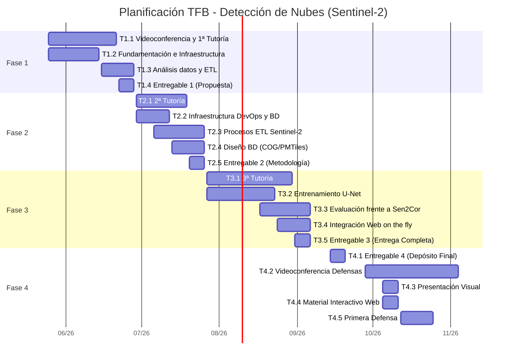

    

# Propuesta del Trabajo Final de Bàtxelor (TFB)

> **🌍 Disponible Online:** Página web del proyecto: [https://tonilogar.github.io/tfb/tfb.html#e1-titulo](https://tonilogar.github.io/tfb/tfb.html#e1-titulo)

## Índice de Acrónimos y Glosario Técnico

Para facilitar la lectura a evaluadores y personas no especialistas en Sistemas de Información Geográfica (GIS) se definen los siguientes términos clave utilizados en este documento:

* **Sentinel-2:** Misión de satélites ópticos de alta resolución (10 metros) perteneciente al programa europeo Copernicus.
* **Sen2Cor:** Software de la Agencia Espacial Europea (ESA) para la corrección admosferica (incluye un detector de nubes básico que este proyecto pretende mejorar).
* **Tiling:** Técnica geoespacial que consiste en "trocear" imágenes satelitales gigantes en cuadrados más pequeños para que el ordenador pueda procesarlos sin saturar la memoria RAM.
* **OOM:** *Out of Memory* (Fuera de memoria). Colapso del ordenador por intentar cargar demasiados datos gráficos a la vez.
* **COG:** *Cloud Optimized GeoTIFF*. Formato de imagen satelital optimizado para ser consultado y procesado de forma rápida y directa en la nube.
* **PMTiles:** Formato de archivo de mapa diseñado para almacenar teselas geoespaciales en la nube de forma estática, optimizando la velocidad y coste del servidor.
* **gpkg:** *GeoPackage*. Formato de base de datos geoespacial moderno, abierto y compacto.
* **shp:** *Shapefile*. Formato de archivo informático vectorial clásico y muy extendido para almacenar sistemas de información geográfica.
* **On the fly:** Procesamiento o renderizado "sobre la marcha" o en tiempo real. Ocurre en el instante exacto en que el usuario lo solicita, sin necesidad de tener los datos pre-procesados.
* **ESA:** *European Space Agency* (Agencia Espacial Europea).
* **ACA:** Agencia Catalana del Agua.
* **ICGC:** Instituto Cartográfico y Geológico de Cataluña.
* **DEM:** *Digital Elevation Model* (Modelo Digital de Elevaciones). Representación en 3D del relieve terrestre.
* **U-Net:** Arquitectura de red neuronal convolucional diseñada para la segmentación semántica de imágenes (asignación de clases píxel a píxel).

---

## 1. Título propuesto

Plataforma Web GIS de Datos Sentinel-2: Detección de nubes mediante modelo de Machine Learning en Cataluña.

## 2. Objetivos del TFB

Desarrollar un entorno escalable (pipeline geoespacial) para imágenes Sentinel-2, diseñado para integrar y ejecutar un modelo de Machine Learning que detectará las nubes sobre el territorio de Cataluña (órbitas R008 y R051).

* 1. Identificar, seleccionar y extraer las fuentes de datos satelitales (Copernicus Sentinel-2), diseñando y desarrollando procesos ETL (Extract, Transform, Load) para su armonización y preparación.
* 2. Diseñar una arquitectura de base de datos orientada a la nube basada en Cloud Optimized GeoTIFF (COG) y PMTiles.
* 3. Entrenar una red neuronal convolucional única (tipo U-Net) integrando datos multiespectrales y topográficos (DEM), con el fin de maximizar la capacidad algorítmica de separar nubes reales de la nieve topográfica.
* 4. Evaluar el rendimiento empírico del modelo frente a los falsos positivos más críticos del procesador estándar Sen2Cor: la nieve de los Pirineos y la superficie del agua profunda (Delta del Ebro y Mar Mediterráneo).
* 5. Construir la infraestructura tecnológica completa (repositorio, servidor online, prácticas DevOps, frontend y backend) para integrar la API de Copernicus y permitir la visualización dinámica (*on the fly*) de imágenes Sentinel-2 en una plataforma Web interactiva.

## 3. Breve justificación de la propuesta

* **Problema que resuelve:** La generación de mosaicos cartográficos limpios a partir de satélites se ve constantemente truncada por las nubes. Los procesadores estándar actuales (como el algoritmo Sen2Cor de la ESA) cometen graves errores ópticos: confunden habitualmente el agua oscura profunda del mar con sombras de nubes, y la nieve de los Pirineos con nubosidad espesa. Este TFB soluciona este problema mediante un modelo único de Inteligencia Artificial adaptativa (robusto a la orografía), centrándose en una zona concreta: Cataluña.
* **Valor aportado y Alineación Estratégica:** Al crear un modelo regional robusto enfocado concretamente en Cataluña, integrando variables físicas y de relieve, se elimina la generalización estadística global de los procesadores estándar. La misma metodología escalable se podrá aplicar en el futuro a los nuevos satélites catalanes.
* **Códigos UNESCO:**
  * **1207.94 (Aprendizaje automático):** Justificado por el entrenamiento de un modelo de Deep Learning (Redes Neuronales U-Net) para la segmentación semántica de imágenes satelitales.
  * **1203.93 (Cloud Computing):** Aplicado en el diseño y despliegue del entorno escalable (pipeline geoespacial) y la infraestructura de procesamiento online.
  * **1203.96 (Bases de Datos):** Requerido para la orquestación y estructuración de la arquitectura orientada a la nube mediante formatos optimizados (Cloud Optimized GeoTIFF y PMTiles).
* **Objetivos de Desarrollo Sostenible (ODS):** 
  * **ODS 9 (Industria, Innovación e Infraestructura):** El proyecto construye una infraestructura tecnológica geoespacial innovadora que mejora las capacidades de procesamiento y análisis de datos de la industria satelital.
  * **ODS 13 (Acción por el clima):** La monitorización precisa de la superficie terrestre (diferenciando de forma fiable la nieve de la nubosidad) proporciona datos limpios y veraces, fundamentales para evaluar el impacto del cambio climático y la gestión de recursos hídricos en Cataluña.

## 4. Propuesta de índice de TFB

1. Introducción, contextualización y objetivos.
2. Fundamentación teórica.
3. Metodología aplicada y justificación de resultados. 
4. Análisis, interpretación y discusión.
5. Conclusiones y aportaciones. 
6. Trabajo futuro.
7. Referencias bibliográficas y citas.

## 5. Alcance previo

* **Alcance positivo (Qué se hará):** Desarrollo de una plataforma Web GIS interactiva. Diseño de una arquitectura Cloud y pipeline de datos geoespaciales. Extracción de series temporales Copernicus Sentinel-2 (órbitas R008 y R051) sobre Cataluña. Entrenamiento de una red neuronal de segmentación semántica (Deep Learning) integrando datos satelitales y topográficos. Pruebas de validación empírica en zonas conflictivas (Pirineos y costa).
* **Alcance negativo (Qué NO se hará):** No se desarrollarán modelos para predecir el clima o el movimiento de las nubes en el futuro. Tampoco se utilizarán otras constelaciones de satélites (como Sentinel-1 radar o Landsat) ajenas a Sentinel-2. El objetivo es puramente de segmentación binaria espacial (nube/no-nube). Solo es aplicable a Cataluña.

## 6. Competencias que desarrollar

| Competencia | DEFINICIÓN | NIVEL ESPERADO |
| ----------- | ----------------------------------------------------------------------------------------------------------------------------------------------------- | -------------- |
| CT1  | Elaborar la memoria del proyecto, y comunicar de manera clara con un lenguaje específico de ciencia de datos.                                         | 4              |
| CT3  | Realizar una investigación que proponga una solución a una problemática real, evaluando y comunicando los resultados.                                 | 4              |
| CT4  | Plantear un proyecto innovador teniendo en cuenta sus condicionantes técnicos, legales y la gestión segura de los datos.                              | 3              |
| CT5  | Plantear un proyecto innovador reflexionando sobre su impacto en la sociedad, su huella ecológica y el equilibrio sostenible.                         | 2              |
| CE2  | Estructurar la información en base a conocimientos y de principios de la ciencia de datos para un uso posterior.                                      | 4              |
| CE3  | Diseñar y gestionar sistemas de información para el almacenamiento y el tratamiento de datos.                                                         | 4              |
| CE4  | Escoger y utilizar técnicas de aprendizaje automático y construir sistemas que se empleen para la toma de decisiones.                                 | 5              |
| CE5  | Escoger y utilizar técnicas de modelización estadística y análisis de datos para la toma de decisiones.                                               | 4              |
| CE8  | Gestionar de forma integral proyectos y planificar el proceso de trabajo y el tiempo de ejecución requerido.                                          | 4              |
| CE10 | Desarrollar las tareas profesionales de gestión y explotación de datos respetando la legislación, normativa y ética vigente.                          | 2              |
| CE11 | Visualizar la información a fin de facilitar la exploración y el análisis de datos para que el usuario final pueda tomar decisiones.                  | 3              |

## 7. Listado de datos necesarios

| ID | DEFINICIÓN / COMENTARIO | Tipo de Fichero | Origen / Fuente | Público | Disponible |
| -- | ----------------------- | --------------- | --------------- | ------- | ---------- |
| 1  | Imágenes multiespectrales Copernicus Sentinel-2 (Órbitas R008 y R051 sobre Cataluña). | `.COG` / `.pmtiles` | ESA ([Copernicus Data Space](https://dataspace.copernicus.eu/)) | Sí | Sí |
| 2  | Máscaras de validación generadas mediante el algoritmo original Sen2Cor para servir de línea base estadística. | `.COG` | ESA ([Copernicus Data Space](https://dataspace.copernicus.eu/)) | Sí | Sí |
| 3  | Modelo Digital de Elevaciones (DEM) de Cataluña para la discriminación topográfica de la cota de nieve y sombras orográficas. | `.COG` | ICGC ([Elevaciones](https://www.icgc.cat/)) | Sí | Sí |

## 8. Análisis de riesgos

* **Riesgo:** Cuellos de botella en la memoria computacional (Out of Memory - OOM) al entrenar redes neuronales con imágenes satelitales gigantescas (10980x10980 px).
  * *Mitigación:* Se diseñará e implementará una fase estricta de *Tiling* para trocear las imágenes en parches matemáticos de 512x512 píxeles antes de introducirlos a la red neuronal.

## 9. Planificación y cronograma de trabajo

### Fase 1 – Planificación y Propuesta Inicial (25/05/2026 – 28/06/2026)
* T1.1. Asistencia a Videoconferencia de planificación (25/05 - 31/05) y 1ª Tutoría (01/06 - 21/06).
* T1.2. Fundamentación teórica y definición de la arquitectura de infraestructura tecnológica (Obj. 5).
* T1.3. Análisis inicial y evaluación de las fuentes de datos satelitales para los procesos ETL (Obj. 1).
* T1.4. Redactar Entregable 1: PROPUESTA INICIAL (22/06 - 28/06).

### Fase 2 – Infraestructura, ETL y Metodología (29/06/2026 – 26/07/2026)
* T2.1. 2ª Tutoría (29/06 - 19/07).
* T2.2. Construcción de la infraestructura: repositorio, servidor online, prácticas DevOps y Web (Obj. 5).
* T2.3. Extracción y armonización de Copernicus Sentinel-2 mediante el desarrollo de procesos ETL (Obj. 1).
* T2.4. Diseño de la arquitectura de base de datos en la nube basada en formatos COG y PMTiles (Obj. 2).
* T2.5. Redactar Entregable 2: DESARROLLO DEL MARCO TEÓRICO Y METODOLOGÍA (60% del avance) (20/07 - 26/07).

### Fase 3 – Entrenamiento Machine Learning y Evaluación (27/07/2026 – 06/09/2026)
* T3.1. 3ª Tutoría (27/07 - 30/08).
* T3.2. Entrenamiento de la red neuronal convolucional (tipo U-Net) integrando DEM y bandas infrarrojas (Obj. 3).
* T3.3. Evaluación empírica de falsos positivos en los Pirineos y masas de agua profunda frente a Sen2Cor (Obj. 4).
* T3.4. Integración de la visualización *on the fly* en el frontend de la plataforma web interactiva.
* T3.5. Documentación Entregable 3: ENTREGA COMPLETA DEL TFT (100% del avance) (31/08 - 06/09).

### Fase 4 – Revisión, Depósito Final y Defensa (14/09/2026 – 25/10/2026)
* T4.1. Redactar Entregable 4: DEPÓSITO FINAL EN 1ª DEFENSA (14/09 - 20/09).
* T4.2. Asistencia a Videoconferencia informativa sobre defensas (28/09 - 04/11).
* T4.3. Síntesis visual y generación de presentación (Entrega material de defensa: 05/10 - 11/10).
* T4.4. Preparación de material interactivo de mapas web para la exposición oral.
* T4.5. Primera defensa ante Tribunal (12/10 - 25/10).

### Resumen del Cronograma

| Fechas | Hito Académico | Tareas Técnicas / Desarrollo |
|--------|----------------|------------------------------|
| **25/05 - 28/06** | **Entrega 1: Propuesta Inicial** | T1.2, T1.3 (Diseño de Infraestructura e inicio ETL). |
| **29/06 - 26/07** | **Entrega 2: Metodología (60%)** | T2.2, T2.3, T2.4 (Full Stack, ETL y Arq. BD). |
| **27/07 - 06/09** | **Entrega 3: Entrega Completa (100%)** | T3.2, T3.3 (Entrenamiento U-Net y Eval. Sen2Cor). |
| **14/09 - 20/09** | **Entrega 4: Depósito Final** | T4.1 (Revisiones finales previas al tribunal). |
| **05/10 - 25/10** | **Primera Defensa ante Tribunal** | T4.3, T4.4 (Generación PPT y preparación oral). |

### 9.1 Diagrama de Gantt

## 10. Bibliografía

Baetens, L., Desjardins, C., & Hagolle, O. (2019). Validation of Copernicus Sentinel-2 Cloud Masks Obtained from MAJA, Sen2Cor, and FMask Processors Using Reference Cloud Masks Generated with a Supervised Active Learning Procedure. *Remote Sensing, 11*(4), 433. https://doi.org/10.3390/rs11040433

European Space Agency [ESA]. (2026). *Copernicus Open Access Hub - Sentinel-2 Data Access*. Recuperado el 25 de junio de 2026, de https://scihub.copernicus.eu/

Hollstein, A., Segl, K., Guanter, L., Kneubühler, M., & Legleiter, C. (2016). Ready-to-Use Methods for the Detection of Clouds, Cirrus, Snow, Shadow, Water and Clear Sky Pixels in Sentinel-2 MSI Images. *Remote Sensing, 8*(8), 666. https://doi.org/10.3390/rs8080666

Institut Cartogràfic i Geològic de Catalunya [ICGC]. (2026). *Models d'Elevacions del Terreny de Catalunya*. Recuperado el 25 de junio de 2026, de https://www.icgc.cat/

Ronneberger, O., Fischer, P., & Brox, T. (2015). U-Net: Convolutional Networks for Biomedical Image Segmentation. *Medical Image Computing and Computer-Assisted Intervention – MICCAI 2015*, 234–241. https://doi.org/10.1007/978-3-319-24574-4_28

Wieland, M., Li, Y., & Martinis, S. (2019). Multi-sensor cloud and cloud shadow segmentation with a convolutional neural network. *Remote Sensing of Environment, 230*, 111203. https://doi.org/10.1016/j.rse.2019.05.022